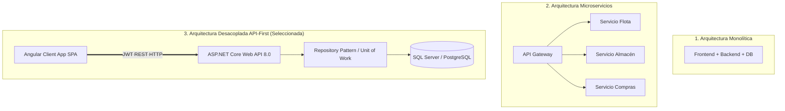
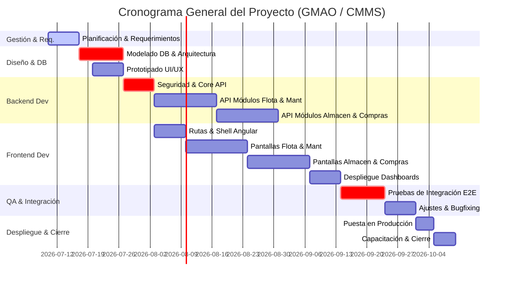

# 4. Diseño, Arquitectura y Planificación del Sistema

Este documento presenta el análisis estratégico de restricciones, la selección y justificación de la arquitectura de software, el marco de validación mediante métricas de calidad y la planificación temporal del proyecto mediante la Estructura de Desglose de Trabajo (EDT) y el diagrama de Gantt para el **Sistema de Gestión de Mantenimiento (GMAO / CMMS)**.

---

## 4.3. ANÁLISIS DE RESTRICCIONES REALISTAS VS ALTERNATIVAS DE SOLUCION

Para determinar la viabilidad de la solución propuesta, se analizan tres alternativas frente a las restricciones del entorno del proyecto:
1. **Alternativa 1 (Propuesta):** Desarrollo a medida de una Aplicación Web SPA (Angular 21+ en frontend y ASP.NET Core 8.0+ Web API en backend).
2. **Alternativa 2 (COTS):** Adquisición e integración de un CMMS comercial de mercado (ej: Fracttal, SAP PM o Infor EAM).
3. **Alternativa 3 (Manual / Legacy):** Hojas de cálculo compartidas (Excel/Access) y registro en papel.

### Tabla de Doble Entrada: Restricciones Realistas vs. Alternativas

| Restricción | Alternativa 1: Desarrollo Web a Medida (Propuesta) | Alternativa 2: Software Comercial (Fracttal/SAP PM) | Alternativa 3: Manual / Hojas de Cálculo (Excel) |
| :--- | :--- | :--- | :--- |
| **Económica** *(Presupuesto, Capex/Opex y Retorno)* | **Media/Alta inicial, Baja a largo plazo.** Requiere inversión en desarrollo de software, pero elimina costos recurrentes de licenciamiento por usuario. | **Muy Alta.** Inversión inicial elevada por licencias y consultores de implantación. Costos Opex anuales recurrentes elevados. | **Muy Baja inicial, Alta oculta.** No hay inversión de software directa, pero genera pérdidas por ineficiencias de control e inventario. |
| **Tecnológica** *(Interoperabilidad, Escalabilidad, Soporte)* | **Excelente.** Desarrollo nativo basado en APIs REST. Permite escalabilidad horizontal en la nube e integración directa con sistemas de hardware locales. | **Alta pero rígida.** La integración con sistemas legados o flotas específicas puede requerir middleware propietario de alto costo. | **Nula.** Silos de información. Imposible de integrar de forma automática o en tiempo real con horómetros u otros sistemas. |
| **De Seguridad y Privacidad** *(Control de accesos, encriptación)* | **Alta.** Control absoluto del código. Autenticación robusta por JWT, interceptores de seguridad en peticiones HTTP y encriptación de datos sensibles. | **Alta.** Cumplimiento de estándares internacionales (ISO 27001), pero los datos sensibles de la operación dependen de servidores de terceros. | **Muy Baja.** Vulnerabilidades de alteración de archivos, pérdida de datos físicos y falta de trazabilidad en las autorizaciones. |
| **Ética y Cumplimiento** *(Seguridad industrial, medio ambiente)* | **Excelente.** Permite personalizar alertas de inspecciones de seguridad (SST) obligatorias antes del uso de equipos críticos de la flota. | **Moderada.** Se debe adaptar el flujo del software estándar para alinearlo con las normativas locales de seguridad industrial. | **Deficiente.** Dificultad para demostrar cumplimiento ético y legal ante auditorías laborales en caso de incidentes. |
| **Político / Organizacional** *(Curva de aprendizaje, adopción)* | **Alta Adopción.** La interfaz está diseñada y adaptada a la terminología del personal del taller (Técnicos, Almaceneros, Jefes). | **Baja Adopción.** Alta resistencia al cambio debido a la complejidad de interfaces generales no adaptadas al flujo local. | **Sin Fricción.** El personal ya conoce las herramientas, pero mantiene procesos deficientes. |

> [!NOTE]  
> **Conclusión del análisis:** La **Alternativa 1 (Desarrollo Web a Medida)** representa el balance óptimo a largo plazo, ya que garantiza un control total del software, escalabilidad sin costos de licenciamiento por volumen y una adaptación total a las necesidades particulares del taller de mantenimiento de flota.

---

## 4.4. ANÁLISIS DE ARQUITECTURAS DE SOFTWARE

La elección de la arquitectura es crítica para garantizar el cumplimiento de los atributos de calidad (rendimiento, mantenibilidad y escalabilidad). Se evaluaron tres enfoques arquitectónicos:

### Comparación de Alternativas de Arquitectura

1. **Arquitectura Monolítica Tradicional:**
   * *Ventajas:* Simplicidad en el despliegue inicial.
   * *Desventajas:* Acoplamiento severo entre la lógica del frontend y el backend, dificultando la evolución de las interfaces interactivas del usuario (como el calendario o el módulo de expedientes).
2. **Arquitectura de Microservicios:**
   * *Ventajas:* Escalabilidad independiente por módulo de negocio.
   * *Desventajas:* Complejidad operacional excesiva para el tamaño del equipo de desarrollo, latencia de red incrementada e inconsistencia eventual de datos.
3. **Arquitectura Desacoplada API-First (Seleccionada):**
   * *Ventajas:* Clara separación de responsabilidades (Separation of Concerns). El frontend es un cliente liviano (SPA Angular 21+) que interactúa con un Backend REST (ASP.NET Core 8.0+). La base de datos es accedida mediante patrones robustos (Repository & Unit of Work) que garantizan transaccionalidad e integridad en operaciones logísticas críticas (como el despacho de vales y Kardex).

### Justificación de la Elección de Arquitectura y Sustento Bibliográfico

La arquitectura **Desacoplada API-First** fue elegida bajo los siguientes principios de ingeniería de software:

* **Mantenibilidad y Modificabilidad:** Siguiendo a **Bass, Clements y Kazman (2012)** en *Software Architecture in Practice*, la separación táctica en capas independientes disminuye el costo del cambio. Si la lógica de almacenamiento de archivos cambia (ej. de disco local a AWS S3), el cambio se encapsula en el `StorageController` y la capa de servicios del backend, sin alterar la UI en Angular.
* **Separación de Responsabilidades (Separation of Concerns):** Postulado por **Robert C. Martin (2017)** en *Clean Architecture*, el desacoplamiento entre el mecanismo de entrega (UI) y las reglas de negocio (Servicios del API) permite pruebas unitarias aisladas. El uso del patrón *Repository* independiza la base de datos de la lógica de negocio, lo que cumple el Principio de Inversión de Dependencia (DIP).
* **Rendimiento e Interactividad:** Al ser una Single Page Application (SPA), la carga inicial se realiza una sola vez. Las transiciones de pantalla son instantáneas y las llamadas asíncronas reducen el consumo de ancho de banda, un aspecto crítico en entornos industriales donde la conexión puede ser inestable.

---

## 4.5. VALIDACION DE LA SOLUCION PROPUESTA

La validación del sistema se realiza a través de un conjunto de métricas cuantitativas y cualitativas distribuidas en cuatro dimensiones clave:

### 1. Métricas de Productividad y Desarrollo
* **Velocidad del Sprint (Sprint Velocity):** Cantidad de puntos de historia completados por sprint. Meta: Variabilidad menor al 10% entre sprints consecutivos para estabilizar la planificación.
* **Densidad de Defectos (Defect Density):** Número de errores reportados en producción por cada 1000 líneas de código (KLOC). Meta: $< 1.5$ defectos por KLOC en los primeros 3 meses de despliegue.
* **Tiempo de Entrega (Lead Time):** Tiempo transcurrido desde que se aprueba un requerimiento hasta que se despliega en producción. Meta: Promedio $< 7$ días útiles.

### 2. Métricas de Rendimiento y Escalabilidad
* **Tiempo de Respuesta del API (Response Time):** Tiempo promedio para resolver peticiones HTTP GET/POST/PUT.
  * Meta en consultas simples (`listar` equipos/proveedores): $< 200\text{ ms}$.
  * Meta en transacciones complejas (`despachar vale` con Kardex): $< 500\text{ ms}$.
* **Rendimiento Máximo (Throughput):** Capacidad del backend de atender peticiones concurrentes. Meta: Soportar un mínimo de $100$ peticiones por segundo (RPS) bajo pruebas de estrés sin fallas de conexión a la base de datos.
* **Disponibilidad del Sistema (Availability):** Meta: $99.9\%$ del tiempo de operación en producción.

### 3. Métricas de Usabilidad y Experiencia de Usuario (UX)
* **Tasa de Éxito en Tareas (Task Completion Rate):** Porcentaje de tareas completadas de forma correcta por el usuario en su primer intento (ej. registrar un horómetro o crear una orden de trabajo). Meta: $> 95\%$.
* **Tiempo de Ejecución de Tarea (Time on Task):** Promedio de segundos requeridos para completar transacciones.
  * Meta para crear una OT: $< 45\text{ segundos}$.
  * Meta para despachar un vale: $< 30\text{ segundos}$.
* **Escala de Usabilidad del Sistema (SUS - System Usability Scale):** Encuesta estándar aplicada al personal operativo. Meta: Puntuación $> 80$ (Excelente).

### 4. Métricas de Seguridad y Privacidad
* **Tiempo de Expiración de Sesión (JWT Expiry Time):** Duración del token de sesión activo. Establecido en $8\text{ horas}$ (duración de la jornada laboral) para mitigar secuestro de sesiones.
* **Tasa de Falsos Positivos de Seguridad:** Alertas de intrusión o intentos fallidos de autenticación. Meta: Monitoreo al 100% de peticiones sin token hacia rutas `/api/v1/*` seguras mediante el middleware de ASP.NET.

---

## 4.6. CRONOGRAMA DEL PROYECTO Y EDT (ESTRUCTURA DE DESGLOSE DE TRABAJO)

### Estructura de Desglose de Trabajo (EDT)

La EDT organiza el trabajo del proyecto en componentes entregables estructurados jerárquicamente:

* **1. Gestión del Proyecto**
  * 1.1. Planificación Inicial y Levantamiento de Requerimientos
  * 1.2. Reuniones de Seguimiento (Sprints)
  * 1.3. Cierre y Evaluación del Proyecto
* **2. Diseño y Arquitectura**
  * 2.1. Diseño de Arquitectura Física y Lógica
  * 2.2. Modelado de Base de Datos Relacional
  * 2.3. Prototipado y Diseño de Interfaces de Usuario (UI/UX)
* **3. Desarrollo del Backend (ASP.NET Core Web API 8.0)**
  * 3.1. Configuración del Núcleo y Seguridad (JWT & Identity)
  * 3.2. Implementación de Módulos (Flota, Mantenimiento, Almacén, Compras, Administración)
  * 3.3. Pruebas Unitarias de Servicios y Controladores
* **4. Desarrollo del Frontend (Angular 21+)**
  * 4.1. Configuración de Arquitectura de Módulos y Ruteo
  * 4.2. Maquetación del Shell y Componentes Compartidos (Shared UI)
  * 4.3. Implementación de Dashboards e Interfaces Operativas
* **5. Integración y Pruebas**
  * 5.1. Pruebas de Integración Frontend-Backend
  * 5.2. Pruebas de Usabilidad y Rendimiento bajo Carga
  * 5.3. Corrección de Bugs e Incidencias
* **6. Despliegue y Cierre**
  * 6.1. Configuración de Entornos (Staging / Producción)
  * 6.2. Capacitación al Personal Operativo
  * 6.3. Entrega de Manuales de Usuario y Código Fuente

---

### Cronograma del Proyecto (Diagrama de Gantt)

El cronograma contempla una duración estimada de 12 semanas para el ciclo de vida de desarrollo de software utilizando metodología ágil Scrum (6 sprints de 2 semanas cada uno).

