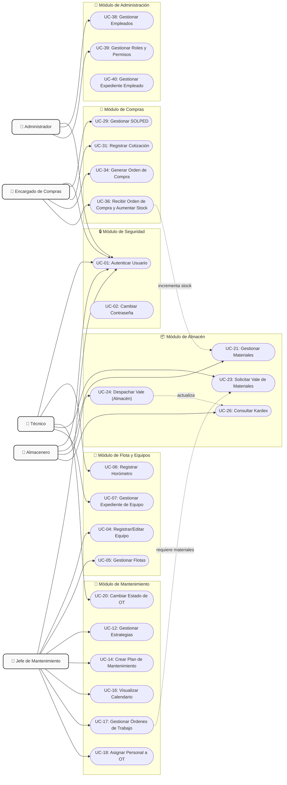

# 5.5.1. Modelo de Casos de Uso del Sistema

Este documento describe detalladamente el **Modelo de Casos de Uso del Sistema (MCU)** para el Sistema de Gestión de Mantenimiento (GMAO / CMMS). El sistema integra la gestión de activos (flota y equipos), planificación y ejecución de mantenimiento, control de inventarios (almacén), adquisiciones (compras) y administración de personal (empleados y roles).

---

## 1. Actores del Sistema

| Actor | Descripción |
| :--- | :--- |
| **Administrador del Sistema** | Responsable de la gestión de usuarios, roles, privilegios, configuración global y plantillas documentales. |
| **Jefe / Planificador de Mantenimiento** | Define estrategias, planes preventivos, programa actividades, asigna órdenes de trabajo (OT), supervisa el calendario y gestiona la flota de equipos. |
| **Técnico de Mantenimiento** | Ejecuta las actividades de las OT asignadas, registra consumos adicionales de repuestos, reporta lecturas de horómetros y realiza solicitudes de materiales (vales). |
| **Encargado de Almacén (Almacenero)** | Controla el stock, registra materiales, despacha vales de repuestos y herramientas, gestiona el Kardex y genera notas de salida/ingreso. |
| **Encargado de Compras** | Gestiona el flujo de adquisición de materiales y servicios: aprueba solicitudes de pedido (SOLPED), registra cotizaciones, emite y aprueba órdenes de compra. |

---

## 2. Diagrama General de Casos de Uso del Sistema

El siguiente diagrama representa los casos de uso organizados por módulos funcionales del sistema y su relación con los diferentes actores.

---

## 3. Especificación de Casos de Uso del Sistema

A continuación se detallan las especificaciones de los casos de uso críticos para cada uno de los módulos funcionales del sistema.

### 3.1. Módulo de Seguridad
#### UC-01: Autenticar Usuario (Login)
*   **Descripción:** Permite a los usuarios ingresar al sistema validando sus credenciales de acceso y asignando su rol correspondiente para la navegación.
*   **Actor Principal:** Todos los Actores.
*   **Precondiciones:** El usuario debe estar registrado en el sistema con un estado "Activo".
*   **Flujo Principal:**
    1. El usuario accede a la URL base del sistema y se le presenta la pantalla de Login.
    2. El usuario introduce su correo electrónico y contraseña.
    3. El sistema valida que las credenciales coincidan con los datos almacenados en la base de datos (Backend `AuthController`).
    4. El sistema genera un Token JWT con los claims correspondientes (DNI, Nombre, Rol, Permisos).
    5. El frontend decodifica el token, guarda el estado de autenticación y redirige al usuario al Dashboard asignado según su rol.
*   **Flujos Alternativos / Excepciones:**
    *   *Credenciales incorrectas:* El sistema muestra un mensaje de error "Usuario o contraseña inválidos" y mantiene al usuario en la pantalla de Login.
    *   *Usuario inactivo:* El sistema informa que la cuenta está deshabilitada y no permite el ingreso.
*   **Postcondiciones:** El usuario tiene acceso a los módulos habilitados por su rol mediante guards en el frontend.

---

### 3.2. Módulo de Flota y Equipos
#### UC-06: Registrar Historial de Horómetro
*   **Descripción:** Permite a los técnicos y supervisores registrar las lecturas del contador de horas de los equipos para el cálculo del mantenimiento preventivo basado en horas de uso.
*   **Actor Principal:** Técnico de Mantenimiento, Jefe de Mantenimiento.
*   **Precondiciones:** El equipo debe estar registrado en el sistema y tener configurado un parámetro de lectura por horómetro.
*   **Flujo Principal:**
    1. El usuario navega al menú de Gestión de Flota y selecciona "Historial de Horómetros".
    2. Selecciona la opción "Registrar Lectura".
    3. El usuario elige el Equipo y digita el valor actual del horómetro, la fecha de lectura y observaciones.
    4. El sistema valida que la nueva lectura sea mayor o igual a la última lectura registrada (Backend `HistorialHorometroController`).
    5. El sistema guarda la lectura, calcula el acumulado y actualiza el contador actual del equipo.
*   **Flujos Alternativos / Excepciones:**
    *   *Lectura menor a la actual:* El sistema muestra una advertencia impidiendo el registro si el valor ingresado es inferior al último guardado.
*   **Postcondiciones:** Se actualiza el horómetro del equipo, lo cual recalcula las fechas estimadas de mantenimiento en los planes preventivos activos.

#### UC-07: Gestionar Expediente de Equipo (Subir Documentación)
*   **Descripción:** Permite subir y asociar documentos técnicos, manuales, certificados de calibración o pólizas de seguro al expediente digital de un equipo específico.
*   **Actor Principal:** Jefe de Mantenimiento, Técnico de Mantenimiento.
*   **Precondiciones:** El equipo debe estar registrado en la base de datos.
*   **Flujo Principal:**
    1. El usuario ingresa a la lista de Equipos y selecciona "Ver Expediente" del activo de interés.
    2. El sistema muestra los documentos previamente clasificados.
    3. El usuario hace clic en "Agregar Documento", selecciona el tipo de documento, digita el código del documento, fecha de emisión/vencimiento e introduce el archivo físico.
    4. El backend (`ExpedienteController`, `StorageController`) sube el archivo a almacenamiento y guarda la referencia en la base de datos asociada al equipo.
    5. El frontend actualiza el listado y muestra el documento adjunto.
*   **Postcondiciones:** El documento queda disponible para su descarga y consulta desde cualquier dispositivo con privilegios.

---

### 3.3. Módulo de Mantenimiento
#### UC-17: Crear Orden de Trabajo (OT) Manual
*   **Descripción:** Permite registrar una Orden de Trabajo correctiva o no programada debido a una falla imprevista o reporte de un operario.
*   **Actor Principal:** Jefe de Mantenimiento.
*   **Precondiciones:** El equipo involucrado debe estar en estado operativo o fuera de servicio pero registrado.
*   **Flujo Principal:**
    1. El usuario navega a "Órdenes de Trabajo" y presiona "Crear OT".
    2. Selecciona el Equipo, Tipo de Mantenimiento (Correctivo, Predictivo, Emergencia), Prioridad, Especialidad requerida, y escribe la descripción de la falla.
    3. Asigna la fecha programada de inicio y el tiempo estimado de ejecución.
    4. Presiona "Guardar".
    5. El backend (`OrdenTrabajoController`) genera el registro en estado "Abierta" y notifica visualmente en el panel.
*   **Postcondiciones:** La OT queda disponible en la lista para asignación de personal y recursos.

#### UC-20: Cambiar Estado de Orden de Trabajo (OT)
*   **Descripción:** Registra el avance de la ejecución de una OT desde su apertura hasta su cierre definitivo, registrando horas hombre e información técnica.
*   **Actor Principal:** Técnico de Mantenimiento, Jefe de Mantenimiento.
*   **Precondiciones:** La OT debe estar asignada al técnico o jefe que realiza el cambio.
*   **Flujo Principal:**
    1. El usuario ingresa al detalle de una OT asignada.
    2. Presiona el botón "Iniciar Trabajo". El estado cambia a "En Proceso" y se registra la fecha/hora de inicio real.
    3. Una vez concluidas las actividades, el técnico selecciona "Terminar Trabajo", ingresa el reporte técnico de la solución y las firmas/conformidades.
    4. El estado cambia a "Ejecutada".
    5. El Jefe de Mantenimiento evalúa los resultados y presiona "Cerrar OT", cambiando el estado a "Cerrada" para bloqueo de modificaciones.
*   **Postcondiciones:** El equipo retorna formalmente a estado operativo y se recalculan costos reales si aplica.

---

### 3.4. Módulo de Almacén
#### UC-23: Solicitar Vale de Materiales (Vincular a OT)
*   **Descripción:** Permite a un técnico de mantenimiento solicitar el despacho de repuestos, lubricantes o herramientas en el almacén asociándolos a una Orden de Trabajo en curso.
*   **Actor Principal:** Técnico de Mantenimiento, Jefe de Mantenimiento.
*   **Precondiciones:** La Orden de Trabajo debe estar en estado "Abierta" o "En Proceso".
*   **Flujo Principal:**
    1. El usuario ingresa al formulario de "Crear Vale" desde la OT o desde la sección de Almacén.
    2. Selecciona la OT de referencia, el técnico solicitante e indica el almacén de origen.
    3. Agrega los materiales requeridos especificando las cantidades.
    4. Presiona "Solicitar".
    5. El backend (`ValeController`) registra el vale en estado "Pendiente" y bloquea temporalmente esa cantidad de stock como "Material Reservado".
*   **Postcondiciones:** El vale queda en espera de que el Almacenero proceda a su despacho físico.

#### UC-24: Despachar Vale de Materiales
*   **Descripción:** Permite al almacenero registrar la entrega física de los materiales solicitados por el personal de mantenimiento, actualizando los saldos del inventario.
*   **Actor Principal:** Encargado de Almacén.
*   **Precondiciones:** Existe un Vale en estado "Pendiente" con cantidades reservadas.
*   **Flujo Principal:**
    1. El almacenero accede a la lista de vales y selecciona el vale pendiente de despacho.
    2. Revisa la disponibilidad de stock físico.
    3. Entrega los materiales al técnico solicitante y selecciona "Despachar".
    4. El backend (`ValeController/despachar`):
        *   Disminuye el stock físico disponible del almacén.
        *   Disminuye la reserva temporal del material.
        *   Registra una transacción de salida en el Kardex del material.
        *   Cambia el estado del Vale a "Despachado".
*   **Postcondiciones:** El stock físico se reduce y la transacción queda auditada en el historial de movimientos de inventario.

---

### 3.5. Módulo de Compras
#### UC-29: Crear Solicitud de Pedido (SOLPED)
*   **Descripción:** Registra un requerimiento formal de compra de repuestos o servicios externos cuando no hay stock disponible en el almacén principal.
*   **Actor Principal:** Jefe de Mantenimiento, Encargado de Almacén.
*   **Precondiciones:** Falta de stock de un material crítico detectada en planificación de mantenimiento o inventariado.
*   **Flujo Principal:**
    1. El usuario ingresa al módulo de Compras, selecciona "Solicitudes de Pedido" y presiona "Crear Solicitud".
    2. Define la prioridad, la fecha límite de entrega, el área solicitante y añade las líneas de materiales con la cantidad requerida.
    3. Presiona "Guardar".
    4. El sistema crea la SOLPED en estado "Pendiente de Aprobación" (Backend `ComprasController/solped`).
*   **Postcondiciones:** La SOLPED se pone a disposición del área de Compras para su evaluación y cotización.

#### UC-36: Recibir Orden de Compra y Aumentar Stock
*   **Descripción:** Registra el arribo físico de los materiales enviados por el proveedor, generando la Nota de Ingreso a almacén y aumentando automáticamente el stock del inventario.
*   **Actor Principal:** Encargado de Almacén / Compras.
*   **Precondiciones:** Existe una Orden de Compra (OC) en estado "Aprobada" o "Emitida".
*   **Flujo Principal:**
    1. El almacenero recibe la guía de remisión y los repuestos en el área de recepción.
    2. Ingresa a la sección "Orden de Compra", busca la OC correspondiente y selecciona "Recibir / Procesar Nota Ingreso".
    3. Digita observaciones, fecha del ingreso, y confirma las cantidades recibidas contra la orden.
    4. Presiona "Procesar".
    5. El backend (`ComprasController/orden-compra/{id}/recibir`):
        *   Crea un registro de Nota de Ingreso en el almacén.
        *   Suma las cantidades ingresadas al stock actual de cada material.
        *   Genera las transacciones correspondientes en el Kardex.
        *   Cambia el estado de la Orden de Compra a "Recibida" o "Parcialmente Recibida".
*   **Postcondiciones:** Los repuestos quedan disponibles para ser solicitados y despachados mediante vales.

---

## 4. Priorización de Casos de Uso del Sistema

La priorización se realiza utilizando el modelo de criticidad del negocio (Core vs. Soporte) y dependencias de arquitectura, permitiendo un desarrollo incremental y ordenado.

| ID | Caso de Uso | Prioridad | Complejidad | Justificación / Dependencia |
| :--- | :--- | :--- | :--- | :--- |
| **UC-01** | Autenticar Usuario (Login) | **Alta** | Media | Puerta de entrada al sistema, requerida para validar la seguridad y los roles de navegación en el Frontend. |
| **UC-04** | Registrar / Editar Equipo | **Alta** | Media | Define el activo sobre el cual gira todo el sistema. No se puede planificar mantenimiento sin activos. |
| **UC-17** | Crear Orden de Trabajo (Manual) | **Alta** | Media | Funcionalidad core del mantenimiento reactivo/correctivo para resolver fallas del día a día. |
| **UC-20** | Cambiar Estado de OT | **Alta** | Media | Permite el flujo operativo de los técnicos y el cierre formal de tareas. |
| **UC-06** | Registrar Horómetro | **Alta** | Baja | Esencial para programar planes basados en uso real del equipo. |
| **UC-23** | Solicitar Vale de Materiales | **Alta** | Media | Conecta el Módulo de Mantenimiento con el Módulo de Almacén. |
| **UC-24** | Despachar Vale de Almacén | **Alta** | Alta | Afecta directamente los stocks del inventario y las cuentas del Kardex. |
| **UC-36** | Recibir Orden de Compra y Aumentar Stock | **Alta** | Alta | Cierra el circuito logístico alimentando el stock disponible del almacén. |
| **UC-14** | Crear Plan de Mantenimiento | **Media** | Alta | Automatiza el mantenimiento preventivo y la generación periódica de OTs. |
| **UC-29** | Crear Solicitud de Pedido (SOLPED) | **Media** | Media | Inicio del proceso de abastecimiento para compras de reposición. |
| **UC-31** | Registrar Cotización | **Media** | Media | Requisito intermedio para la toma de decisiones de compra en base a precios. |
| **UC-07** | Gestionar Expediente de Equipo | **Media** | Media | Centraliza manuales e información técnica pero no detiene la operación diaria. |
| **UC-16** | Visualizar Calendario | **Media** | Media | Interfaz visual clave para planificación de parada de equipos. |
| **UC-26** | Consultar Kardex | **Media** | Media | Auditoría y control de movimientos de materiales en almacén. |
| **UC-38** | Registrar / Editar Empleado | **Media** | Baja | Permite dar de alta al personal, necesario para asignar responsabilidades. |
| **UC-39** | Gestionar Roles y Permisos | **Baja** | Media | Configuración de seguridad avanzada. Inicialmente se maneja con roles estándar pre-sembrados. |
| **UC-02** | Cambiar Contraseña | **Baja** | Baja | Funcionalidad de autoservicio de seguridad. |
| **UC-40** | Gestionar Expediente Empleado | **Baja** | Baja | Repositorio documental de recursos humanos. |
