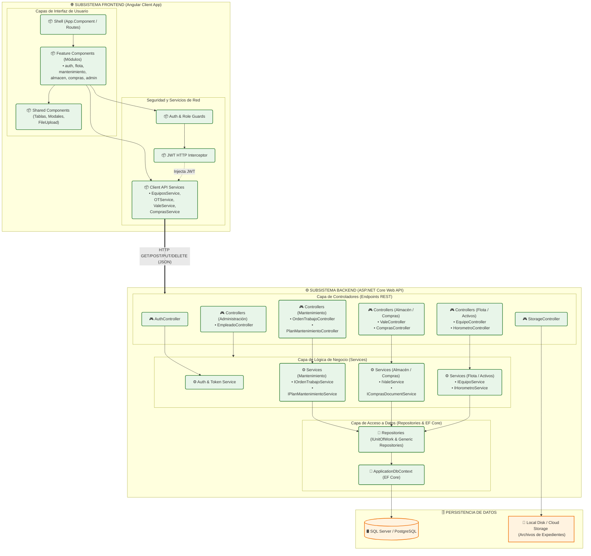

# 5.5.2. Diagrama de Componentes del Sistema

Este documento describe la arquitectura física y lógica del Sistema de Gestión de Mantenimiento (GMAO / CMMS) mediante un **Diagrama de Componentes**. Se detallan los subsistemas del Frontend (Angular 21+), Backend (ASP.NET Core Web API 8.0+) y sus interacciones con las capas de base de datos y almacenamiento.

---

## 1. Arquitectura General y Capas

El sistema sigue un patrón de arquitectura desacoplado y en capas:
1.  **Capa de Presentación (Frontend):** Implementada en Angular como una Single Page Application (SPA), dividida por módulos auto-contenidos (*features*), servicios compartidos y guardianes de ruta.
2.  **Capa de Servicios API (Backend):** Una API REST en ASP.NET Core orientada al dominio, estructurada en base a Controladores (Controllers), Capa de Negocio (Services) y Capa de Acceso a Datos (Repositories / Entity Framework Core).
3.  **Capa de Persistencia:** Base de datos relacional y almacenamiento en disco/nube para archivos físicos (expedientes).

---

## 2. Diagrama de Componentes del Sistema

El siguiente diagrama representa los componentes de software principales y los puertos/interfaces de comunicación entre ellos.



---

## 3. Descripción Detallada de los Componentes

### 3.1. Subsistema Frontend (Angular Application)

*   **Shell (App Module / Route Shell):** Define el contenedor estructural de la aplicación, el sistema de navegación (sidebar/navbar) y las rutas hijas seguras de la aplicación.
*   **Feature Components (Componentes de Módulos):** Contiene las pantallas específicas agrupadas por contexto de negocio:
    *   `auth`: Vistas de Login y control de sesión.
    *   `flota`: Pantallas de lista de equipos, detalles de expedientes y registros de horómetros.
    *   `mantenimiento`: Gestión de órdenes de trabajo (OTs), planes de mantenimiento preventivo, estrategias y calendario interactivo.
    *   `almacen`: Control de inventario de materiales, generación de vales de repuestos y visualización de Kardex.
    *   `compras`: Creación y aprobación de solicitudes de pedido (SOLPED), cotizaciones y órdenes de compra.
    *   `m-administracion`: Altas de personal y asignación de roles.
*   **Shared Components (Componentes Compartidos):** Componentes visuales genéricos y utilitarios reutilizables como tablas paginadas, modales de confirmación, visores de PDF/documentos y selectores de archivos.
*   **Auth Guard / Role Guard (Guardianes de Rutas):** Interceptan el ciclo de enrutamiento del navegador para verificar si el usuario tiene una sesión activa y posee el rol adecuado (`GestionCompras`, `GestionAlmacen`, `GestionMantenimiento`, `GestionFlota`, `GestionAdministracion`) para acceder a la ruta.
*   **JWT HTTP Interceptor:** Intercepta de manera global todas las peticiones salientes `HttpClient` para inyectar la cabecera `Authorization: Bearer <Token_JWT>` obtenida del almacenamiento local.
*   **Client API Services (Servicios de Comunicación):** Encapsulan las llamadas HTTP hacia la API del backend utilizando el servicio `HttpClient` de Angular, mapeando las respuestas crudas en clases o interfaces de TypeScript.

---

### 3.2. Subsistema Backend (ASP.NET Core Web API)

*   **Controllers (Controladores REST):** Exponen los endpoints públicos del sistema en la ruta base `/api/v1/`. Reciben los datos como DTOs (Data Transfer Objects), validan el modelo (ModelState) y delegan la lógica a los servicios.
*   **Storage Controller:** Componente específico para la recepción física de archivos binarios (expedientes de equipos y empleados), validando extensiones de seguridad y guardando los archivos en el servidor de archivos (Local Disk) o servicios de nube.
*   **Logic Services (Servicios de Negocio):** Implementan las reglas del negocio. Validan estados transaccionales, coordinan flujos de información (ej: que al despachar un vale se disminuya el stock físico del almacén), y gestionan las transacciones de base de datos a través de la capa de datos.
*   **Repositories (Repositorios & Unit of Work):** Capa de abstracción del acceso a datos que implementa consultas genéricas y personalizadas mediante Entity Framework Core, aislando el negocio directo de la sintaxis SQL.
*   **ApplicationDbContext:** Representación del contexto de la base de datos EF Core que configura el mapeo relacional de entidades (ORM) y gestiona el ciclo de vida de la conexión con SQL Server / PostgreSQL.

---

## 4. Flujo de Comunicación e Interacción

El flujo de comunicación entre los componentes se realiza siguiendo el patrón **Cliente-Servidor Apátrida (Stateless)** usando Tokens JWT:

```mermaid
sequenceDiagram
    autonumber
    actor Usuario
    participant FE_Comp as Feature Component (Angular UI)
    participant FE_Serv as Client API Service (Angular)
    participant BE_Ctrl as Controller (Backend Web API)
    participant BE_Serv as Business Service (Backend)
    participant BE_Repo as Repository (EF Core)
    database DB as Base de Datos

    Usuario->>FE_Comp: Hace clic en "Crear Orden de Trabajo"
    FE_Comp->>FE_Serv: invoca a `crearOT(request)`
    Note over FE_Serv: El Interceptor añade<br/>el Token JWT en la cabecera
    FE_Serv->>BE_Ctrl: HTTP POST /api/v1/OrdenTrabajo (JSON)
    Note over BE_Ctrl: El Middleware de Seguridad<br/>valida el JWT y permisos de Rol
    BE_Ctrl->>BE_Serv: llama a `CreateManualAsync(request)`
    Note over BE_Serv: Ejecuta lógica comercial,<br/>valida si el equipo existe
    BE_Serv->>BE_Repo: llama a `AddAsync(entity)`
    BE_Repo->>DB: Ejecuta INSERT INTO OrdenesTrabajo
    DB-->>BE_Repo: Retorna ID generado
    BE_Repo-->>BE_Serv: Retorna Entidad guardada
    BE_Serv-->>BE_Ctrl: Retorna ResultDTO (Success = true)
    BE_Ctrl-->>FE_Serv: HTTP 200 OK / 201 Created (JSON Response)
    FE_Serv-->>FE_Comp: Retorna Observable con Datos
    FE_Comp-->>Usuario: Muestra mensaje de éxito en pantalla
```
